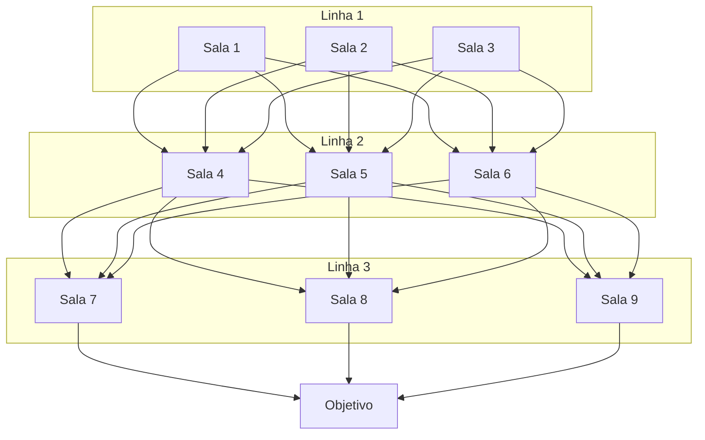

# Incursões 2.0 — Bot de Discord (design)

2026-09-19 · @Someone

## Visão geral

Incursões 2.0 é um bot de Discord que leva a mecânica de Incursões (missões off-mesa ligadas às quatro Organizações de Sheidrost: Vórtice Oculto, Aliança das Sombras, Guilda dos Mortos, Sentinelas do Alvorecer) para um loop de dungeon crawl com mapa ramificado, inspirado em ReRoll Hero e Até o Trono.

Cada grupo fixo de 5 jogadores usa o próprio personagem de D&D, avança sala a sala votando o que fazer, resolve testes de perícia com o modificador real da ficha, e sai com pontos de Organização conforme o resultado — sucesso, desistência ou fracasso.

## Modelo de dados

| Entidade | Campos principais |
| --- | --- |
| Personagem | jogador, nome, nível, 6 atributos, perícias treinadas, tier (derivado do nível), CA, bônus de ataque, dano de arma, HP máximo, última incursão (timestamp, pro limite semanal) |
| Incursão (definição) | organização, nome, mapa de salas (grafo pré-desenhado), recompensas por sala/objetivo |
| Sala (nó do grafo) | tipo (combate, descanso, armadilha, evento, tesouro), perícia(s) do teste, descrição, imagem (representando a sala/desafio), conexões para as próximas salas, e (só em Combate) monstro: CA, bônus de ataque, dano, HP |
| Run (instância) | incursão\_id, grupo (5 personagens), sala atual, status (em andamento, desistiu, sucesso, fracasso) |

## Ficha digital e sincronização

O bot guarda só nível + os 6 atributos + quais perícias são treinadas. O bônus de proficiência é calculado automaticamente a partir do nível (regra padrão de 5e), então o modificador de qualquer perícia sai certo sem precisar recadastrar a ficha inteira a cada mudança.

```latex
\text{bônus de proficiência} = 2 + \left\lfloor \frac{\text{nível} - 1}{4} \right\rfloor
```

Atualização manual só é necessária em dois casos:

- `/ficha nivel <novo nível>` — quando o personagem sobe de nível
- `/ficha atributo <atributo> <novo valor>` — quando ganha um ASI (aumento de atributo)

Cadastro inicial: `/ficha registrar` (nível, atributos, perícias treinadas).

## Estrutura das salas

Cada incursão tem um mapa pré-desenhado por você (GM): uma árvore de salas com ramificações, montada antes de rodar. O bot revela só a sala atual e as opções de saída dela — a próxima sala só aparece quando o grupo efetivamente entra nela, preservando a sensação de descoberta.

**Mensagem da sala**: ao entrar, o bot posta uma mensagem (embed) com a descrição da sala, o desafio/perícias envolvidas e uma imagem representando a cena. Nesse momento **não há botões de próxima sala ainda** — só depois que o desafio é resolvido (teste feito, ver seção Testes em sala) o bot edita a mensagem ou posta uma nova mostrando o resultado e habilitando os botões **1**, **2**, **3**... — um por sala seguinte possível daquele ponto da árvore.

**Progressão em 3 linhas, sem pular etapa**: a incursão tem 3 linhas de 3 salas cada. O grupo escolhe uma sala da linha atual e avança pra qualquer sala da próxima linha — todas as salas de uma linha se conectam a todas as da linha seguinte — mas não dá pra pular da linha 1 direto pra linha 3, nem voltar pra uma linha anterior.



Como toda sala de uma linha se conecta a todas as da próxima, na prática isso é mais simples de implementar do que parece: não precisa de uma árvore com caminhos específicos por onde passou antes — é **3 rodadas de escolha entre 3 opções**, sempre as mesmas 3 por linha, independente do que foi escolhido na linha anterior. 9 salas de conteúdo no total, mais a sala de Objetivo no final.

Tipos de sala:

- **Combate** — enfrenta um inimigo ou obstáculo ativo
- **Descanso** — sem teste, recupera recursos
- **Armadilha** — teste de perícia, risco sem inimigo
- **Evento/Investigação** — decisão narrativa, pode ou não pedir teste
- **Tesouro** — chance de materiais extras, às vezes com um teste para obter

## Testes em sala

Cada sala tem uma CD fixa por dificuldade (ex.: Fácil = 10, Média = 15, Difícil = 20 — igual pra qualquer grupo, não depende do tier). Os 5 jogadores rolam contra essa CD, cada um usando a perícia que for melhor pra si entre as listadas:

As 3 linhas usam a **mesma CD** — a dificuldade não escala por linha. O conteúdo específico de cada uma das 9 salas + a sala de Objetivo (desafio, perícias, CD, e o monstro nas salas de Combate) fica numa planilha separada, não neste documento.

- Quem tira **abaixo da CD** contribui 0 pontos de progresso pro grupo (nunca negativo) e sofre a consequência de falha individual (tabela abaixo).
- Quem tira **acima da CD** contribui o quanto passou (margem = rolagem + mod − CD) como pontos de progresso.
- A sala é superada quando a soma dos pontos de progresso do grupo atinge o alvo daquela sala — a calibrar por dificuldade (ponto de partida pra playtest: 5 na Fácil, 10 na Média, 15 na Difícil).

Isso faz todo mundo rolar e importar de verdade — cada acerto soma — mas o pior resultado possível de qualquer jogador é contribuir zero, nunca reduzir o que o resto do grupo já conquistou. Ter alguém de tier baixo no grupo nunca piora a chance de sucesso da sala, só deixa de melhorá-la tanto quanto um forte melhoraria.

A soma dos pesos por tier (calibrada nas seções anteriores) continua existindo, mas só no teste do **objetivo principal** da incursão (seção Pontuação com as Organizações) — ali sim o grupo todo pesa, porque é o desempenho da run inteira, não de uma sala isolada.

### Sala de Combate

Combate não usa a margem-vs-CD acima — tem mecânica própria, com CA, bônus de ataque e HP:

1. **Rodada de ataque**: os personagens presentes rolam ataque (d20 + bônus de ataque) contra a CA do monstro. Quem acerta causa dano (dado da arma + mod), somado ao total causado nele.
2. **Contra-ataque**: o monstro ataca de volta (d20 + bônus de ataque dele) contra a CA de um personagem — escolhido pelo grupo ou sorteado. Se acertar, tira o dano do HP daquele personagem.
3. Repete rodadas até o **monstro perder todo o HP** (sala superada) ou **HP do personagem zerar** (ele cai, fica fora do resto do combate).

Se o grupo perder condições de continuar (todos os personagens caídos, ou decidirem recuar), é o cenário de **fracasso total** já descrito para salas de Combate.

A severidade da consequência ao falhar ainda depende do tipo de sala:

| Tipo de sala | Quem falhou individualmente (rolou abaixo da CD) |
| --- | --- |
| Combate | Aquele personagem sofre dano/fica fora do combate; a sala em si é superada se alguém do grupo passou |
| Armadilha | Aquele personagem sofre penalidade leve (dano, gasta material); o grupo segue se alguém passou |
| Evento/Investigação | Aquele personagem não contribui pra descoberta, sem dano; o grupo segue se alguém passou |
| Tesouro | Não pega o item extra; sem outra penalidade |

**Fracasso total** da run (a run termina sem pontos de Organização) só acontece se o grupo for derrotado de vez em combate (sem condições de continuar ou recuar) — não em qualquer teste individual falhado.

## Votação do grupo

A run é **assíncrona**: o grupo não precisa estar todo online ao mesmo tempo, avança sala a sala conforme os jogadores forem votando ao longo do dia/semana.

A votação acontece por clique nos botões numerados (1, 2, 3...) que aparecem na mensagem da sala assim que o desafio é resolvido — cada jogador do grupo clica na opção que prefere. O bot espera até **30 minutos** (timer máximo), mas **fecha antes e já avança** assim que os 5 jogadores do grupo tiverem votado, sem precisar esperar o tempo todo. Se o timer estourar sem todos votarem, decide pela maioria simples dos votos registrados até lá. Empate ou tempo esgotado sem nenhum voto → ação padrão conservadora (não avança / mantém posição atual), evitando travar o jogo esperando gente ausente.

## Pontuação com as Organizações

Cada incursão está ligada a uma das quatro Organizações (Vórtice Oculto, Aliança das Sombras, Guilda dos Mortos, Sentinelas do Alvorecer). Completar o objetivo principal da run dá pontos com essa Organização; salas secundárias (tesouro, evento) podem dar bônus menores.

O teste de objetivo principal reaproveita a fórmula já calibrada nas Incursões originais — soma dos pesos por tier dos 5 participantes, mais uma constante de ajuste:

```latex
\text{alvo} = \sum_{i=1}^{5} \text{peso}(\text{tier}_i) + C
```

Com os modificadores reais dos seus personagens (\~+2,5 acima da baseline que os pesos assumem), a simulação apontou **C ≈ +9 a +10** para manter a taxa de sucesso na faixa de 50–65% desejada.

**Recompensa**: completar o objetivo (sucesso) dá **10 MEs por participante**, retomando a proposta original de Incursões (\~80 MEs a cada dois meses de participação regular).

## Comandos sugeridos

| Comando | Função |
| --- | --- |
| `/ficha registrar` | Cadastra nível, atributos e perícias treinadas de um personagem |
| `/ficha nivel <n>` | Atualiza o nível (recalcula bônus de proficiência sozinho) |
| `/ficha atributo <attr> <valor>` | Atualiza um atributo após ASI |
| `/incursao entrar <id>` | Grupo entra na incursão (bloqueado pra quem já participou dentro do intervalo configurado) |
| `/incursao sala` | Posta (ou reenvia) a mensagem da sala atual: descrição, desafio e imagem |
| `/incursao votar <opção>` | Vota manualmente por comando (fallback caso os botões da mensagem não funcionem) |
| `/incursao teste <perícia>` | Realiza um teste de perícia, com o modificador calculado da ficha |
| `/incursao desistir` | Propõe desistência (abre votação) |
| `/incursao status` | Mostra o estado atual da run: sala, progresso na sala, participantes |
| /config intervalo \<dias> | (admin) Define o intervalo mínimo entre incursões de um mesmo jogador — padrão 7 dias, ajustável |

## Roadmap de implementação

1. **MVP** — fichas digitais, 1 incursão com 3 linhas × 3 salas (9 no total) + objetivo, sem backtracking, mensagens de sala com imagem, botões de próxima sala, testes automáticos
2. **Expansão** — mais tipos de sala, várias incursões simultâneas rodando em paralelo (grupos diferentes), pontuação de Organização completa
3. **Estresse (estilo Darkest Dungeon)** — só depois de tudo acima estar estável, como já foi sugerido: é a peça mais complexa e não bloqueia o resto

## Stack técnica e hospedagem

**Linguagem**: Python com discord.py. É a combinação com mais exemplos corretos e documentação madura pra qualquer IA (Claude Code incluso) gerar e manter — menos gambiarra que alternativas em outras linguagens pra esse tipo de bot.

**Hospedagem gratuita, sem usar seu PC**: Oracle Cloud Always Free continua sendo a melhor opção de graça pra algo que precisa ficar online 24/7 — é uma VM de verdade, sem sleep/hibernação (diferente de free tiers como Render, Railway ou Fly.io hoje em dia, que ou cobram ou dormem o processo depois de um tempo — o que mata um bot que precisa manter conexão constante com o Discord).

- Use a shape **VM.Standard.E2.1.Micro** (AMD, sempre gratuita) em vez da Ampere A1. A A1 teve o limite cortado de 4 OCPU/24GB para 2 OCPU/12GB em junho de 2026, e sofre com erro de "capacidade esgotada" na hora de provisionar. A E2.1.Micro é bem mais fraca (\~1/8 OCPU, \~1GB RAM), mas sobra à vontade pra um bot de Discord.
- O cadastro pede cartão pra verificação antifraude (não cobra nada dentro do Always Free) e a Oracle anda com aprovação de conta nova mais rígida em 2026 — se travar, vale insistir.
- Alternativa que você já tem rodando de graça e sem cadastro nenhum: o seu homelab. Só uma questão de expor a porta certa ou subir um container lá, sem depender de terceiros — se decidir que usar infra própria (não é seu PC pessoal) não quebra o requisito.
